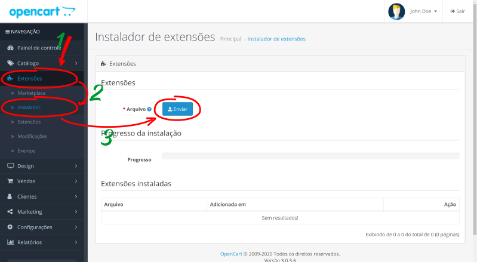

## Model Number Generator Multilanguage - OpenCart v3.x (OCMOD)
***
#### Tabela de conteúdo

- [1. Visão geral](#1-visão-geral)
- [2. Recursos](#2-recursos)
- [3. Pré-requisito](#3-pré-requisito)
- [4. Instalação](#4-instalação)
  - [4.1. Instalando o módulo](#41-instalando-o-módulo)
  - [4.2. Habilitando e atualizando as modificações](#42-habilitando-e-atualizando-as-modificações)
    - [4.2.1. Ativar as modificações do módulo](#421-ativar-as-modificações-do-módulo)
    - [4.2.2. Atualizar o cache de modificações](#422-atualizar-o-cache-de-modificações)
- [5. Permissão de acesso e modificação do módulo](#5-permissão-de-acesso-e-modificação-do-módulo)
- [6. Habilitando o módulo](#6-habilitando-o-módulo)
- [7. Configuração](#7-configuração)
  - [7.1. Acessando as configurações](#71-acessando-as-configurações)
  - [7.2. Configurando o módulo](#72-configurando-o-módulo)
    - [7.2.1. Prefixo](#721-prefixo)
    - [7.2.2. Sufixo](#722-sufixo)
    - [7.2.3. Tipos de numeração](#723-tipos-de-numeração)
      - [7.2.3.1. Sequencial](#7231-sequencial)
      - [7.2.3.2. Aleatório](#7232-aleatório)
      - [7.2.3.3. Data e hora](#7233-data-e-hora)
    - [7.2.4. Comprimento de caracteres](#724-comprimento-de-caracteres)
    - [7.2.5. Fuso hórario](#725-fuso-hórario)
    - [7.2.6. Autocompletar](#726-autocompletar)
    - [7.2.7. Bloquear duplicados](#727-bloquear-duplicados)
    - [7.2.8. Status](#728-status)
- [8. Uso](#8-uso)
- [9. Desinstalação](#9-desinstalação)
  - [9.1. Passo 1 - Excluir o módulo](#91-passo-1---excluir-o-módulo)
  - [9.2. Passo 2 - Atualizar modificações](#92-passo-2---atualizar-modificações)
- [10. Licença](#10-licença)
- [11. Contato e suporte](#11-contato-e-suporte)

# 1. Visão geral
   Gera automaticamente números de modelos para novos produtos e para produtos previamente cadastrados.

# 2. Recursos
+ [3 tipos de numeração](#723-tipos-de-numeração)
   - [Sequencial](#7231-sequencial)
   - [Aleatório](#7232-aleatório)
   - [Data e hora](#7233-data-e-hora)
+ [Prefixo](#721-prefixo)
+ [Sufixo](#722-sufixo)
+ [Autocompletar](#725-autocompletar)
+ [Bloqueia modelos duplicados](#726-bloquear-duplicados)
+ Multi-idioma
   - Inglês (en-gb)
   - Português (pt-br)

# 3. Pré-requisito
+ OpenCart v3.x
+ É necessário que o usuário possua as seguintes permissões de acesso e modificação
  - *Painel de controle > Extensões > Instalador OCMOD*
  - *Painel de controle > Extensões > Modificações*
  - *Painel de controle > Extensões > Extensões*
  - *Painel de controle > Sistema > Usuários > Grupos de usuários*
  - *Painel de controle > Catálogo > Produtos*

> Após a instalação, será necessário conceder permissão de acesso e modificação às configurações do módulo, veja o tópico [Permissão de acesso e modifição do módulo](#5-permissão-de-acesso-e-modificação-do-módulo)

# 4. Instalação

## 4.1. Instalando o módulo  
No **_Painel de controle_**:
1. Vá em **_Extensões > Instalador_**;
2. No campo **_Arquivo_** clique em **_Enviar_**.

<figure>
   
   <figcaption>Imagem 1</figcaption>
</figure>

Na caixa de diálogo **_Abrir_**, localize o arquivo **model_number_generator_multilang_3.x.ocmod.zip**, selecione-o e clique em **_Abrir_**, ou clique duas vezes sobre o nome arquivo para abrir. 
<figure>
   
   <figcaption>Imagem 2</figcaption>
</figure>

Por favor, aguarde o final da instalação. Ao finalizar, o módulo será listado na tabela **_Extensões instaladas_**.
<figure>
   
   <figcaption>Imagem 3</figcaption>
</figure>

## 4.2. Habilitando e atualizando as modificações
No **_Painel de controle_**:
   1. Vá em **_Extensões > Modificações_**.
   2. Verifique se o módulo está **_Habilitado_**.

<figure>
   
   <figcaption>Imagem 4</figcaption>
</figure>

### 4.2.1. Ativar as modificações do módulo
Caso o módulo esteja **_Desabilitado_**, clique em **_Ativar_** no canto direito da tela.
<figure>
   
   <figcaption>Imagem 5</figcaption>
</figure>

### 4.2.2. Atualizar o cache de modificações
Após [Ativar as modificações do módulo](#421-ativar-as-modificações-do-módulo), é necessário atualizar o cache de modificações clicando em **_Atualizar_**. 
<figure>
   
   <figcaption>Imagem 6</figcaption>
</figure>

# 5. Permissão de acesso e modificação do módulo
No **_Painel de controle_**:
  1. Vá em **Configurações > Gerenciar usuários > Grupos de usuários**;
  2. Localize a linha do grupo que será editado(no exemplo o grupo *Administrator*);
  3. Clique em **Editar** no final da linha.
<figure>
   
   <figcaption>Imagem 7</figcaption>
</figure>

1. Em **_Permissões de acesso_** e **_Permissões de modificações_**, localize e marque a caixa de seleção nas linhas **_extension/module/model_number_generator_multilang_**.
2. Clique em **_Salvar_**.
<figure>
   
   <figcaption>Imagem 8</figcaption>
</figure>

# 6. Habilitando o módulo
No **_Painel de controle_**.
  1. Vá em **_Extensões > Extensões_**.
  2. Em **_Selecione o tipo de extensão_**, selecione **_Módulos_**.
  3. Localize a linha do módulo - **_Generate Model Number Multilang_**.
  4. Clique em **_Instalar_** no final da linha.
<figure>
   
   <figcaption>Imagem 9</figcaption>
</figure>

# 7. Configuração
## 7.1. Acessando as configurações
No **_Painel de controle_**:
  1. Vá em **_Extensões > Extensões_**.
  2. Em **_Selecione o tipo de extensão_**, selecione **_Módulos_**.
  3. Localize a linha do módulo - **_Generate Model Number Multilang_**.
  4. Clique em **_Editar_** no final da linha.
<figure>
   
   <figcaption>Imagem 10</figcaption>
</figure>

## 7.2. Configurando o módulo
Após [Acessar as configurações](#71-acessando-as-configurações), será aberto a tela de configuração do módulo.
<figure>
   
   <figcaption>Imagem 11</figcaption>
</figure>

### 7.2.1. Prefixo
Adiciona um prefixo a **todos** os números gerados pelo módulo.

### 7.2.2. Sufixo
Adiciona um sufixo a **todos** os números gerados pelo módulo.

### 7.2.3. Tipos de numeração
   Configura o tipo de numeração que será utilizado. 

#### 7.2.3.1. Sequencial
   Gera um número sequencial com comprimento mínimo de caracteres definido em [Comprimento de caracteres](#724-comprimento-de-caracteres).

#### 7.2.3.2. Aleatório
   Gera um número aleatório alfanuméricos utilizando apenas letras e números (a-z e 0-9) com comprimento de caracteres definido em [Comprimento de caracteres](#724-comprimento-de-caracteres)

#### 7.2.3.3. Data e hora
Gera um número utilizando a data e hora tendo como base o fuso horário definido em [Fuso hórario](#fuso-hórario), no formato AAAAMMDDhhmmss, onde:
   * AAAA = Ano com 4 digitos;
   * MM = Mês com 2 dígitos;
   * DD = Dia com 2 dígitos;
   * hh = Hora com 2 dígitos no sistema 24h - (de 00 a 23);
   * mm = Minutos com 2 dígitos - (de 00 a 59);
   * ss = Segundos com 2 dígitos - (de 00 a 59);

### 7.2.4. Comprimento de caracteres
Determina o comprimento mínimo de caracteres que serão utilizados para gerar os números. 
Este campo é utilizado apenas para os tipos **_Sequencial_** e **_Aleatório_**.

> Quando o tipo de numeração for [sequencial](#7231-sequencial):
> 
> Se o número a ser gerado tiver menos caracteres que o mínimo definido ele será preenchido com zeros à esquerda até atingir o comprimento determinado. Caso o último número gerado tenha atingido o valor máximo para a quantidade de caracteres definida, os próximos números serão acrescido de um dígito.

|Comprimento de caracteres definido|Maior número atual|Próximo número|
|:--:|:--:|:--:|
|3|099|100|
|3|999|1000|
||||

 

> Quando o tipo de numeração for [aleatório](#7232-aleatório), o comprimeto de caracteres será sempre fixo.

### 7.2.5. Fuso hórario
Selecione o fuso horário para criar números do tipo Data e hora.

### 7.2.6. Autocompletar
Gera automaticamente um número ao iniciar o cadastro de um novo produto.

### 7.2.7. Bloquear duplicados
Impede o cadastro de números de modelos duplicados.

### 7.2.8. Status
Habilita ou desabilita as configurações.

# 8. Uso

No **_Painel de controle_**:
  1. Vá em **_Catálogo > Produtos_**.

No formulário de inclusão ou edição de produtos, clique no botão **Gerar número de modelo** e num novo número será gerado preenchendo o campo modelo.

<figure>
   
   <figcaption>Imagem 12</figcaption>
</figure>

# 9. Desinstalação
Para desinstalação completa do módulo siga os 2 passos abaixo.
  * [Passo 1 - Excluir módulo (deletar arquivos)](#91-passo-1---excluir-o-módulo)
  * [Passo 2 - Atualizar modificações](#92-passo-2---atualizar-modificações)

## 9.1. Passo 1 - Excluir o módulo

No **_Painel de controle_**:
1. Vá em **_Extensões > Instalador_**;
2. Localize a linha do módulo - **_Generate Model Number Multilang_**.
3. Clique em **_Desinstalar_** no final da linha.

<figure>
   
   <figcaption>Imagem 13</figcaption>
</figure>

## 9.2. Passo 2 - Atualizar modificações

No **_Painel de controle_**:
   1. Vá em **_Extensões > Modificações_**.
   2. Clique em **_Atualizar_**.

<figure>
   
   <figcaption>Imagem 14</figcaption>
</figure>

# 10. Licença

GNU General Public License version 3 (GPLv3) - https://www.gnu.org/

# 11. Contato e suporte

Rodrigo Barbosa - ab.rodrigo@outlook.com
