## Model Number Generator Multilanguage - OpenCart v3.x (OCMOD)
#### [Module link](https://www.opencart.com/index.php?route=marketplace/extension/info&member_token=WLqKHdv5dxRfQMg1JBLZdQpIzBEE6ZEP&extension_id=40900)

#### Table of Contents

- [1. Overview](#1-overview)
- [2. Resources](#2-resources)
- [3. Prerequisite](#3-prerequisite)
- [4. Installation](#4-installation)
  - [4.1. Installing the module](#41-installing-the-module)
  - [4.2. Enable and updating modifications](#42-enable-and-updating-modifications)
    - [4.2.1. Activate module modifications](#421-activate-module-modifications)
    - [4.2.2. Update the modification cache](#422-update-the-modification-cache)
- [5. Permission to access and modify the module settings](#5-permission-to-access-and-modify-the-module-settings)
- [6. Enable the module](#6-enable-the-module)
- [7. Configuration](#7-configuration)
  - [7.1. Accessing settings](#71-accessing-settings)
  - [7.2. Setting configurations](#72-setting-configurations)
    - [7.2.1. Prefix](#721-prefix)
    - [7.2.2. Suffix](#722-suffix)
    - [7.2.3. Numbers types](#723-numbers-types)
      - [7.2.3.1. Sequential](#7231-sequential)
      - [7.2.3.2. Random](#7232-random)
      - [7.2.3.3. Date and time](#7233-date-and-time)
    - [7.2.4. Character length](#724-character-length)
    - [7.2.5. Time zone](#725-time-zone)
    - [7.2.6. Autocomplete](#726-autocomplete)
    - [7.2.7. Block duplicates](#727-block-duplicates)
    - [7.2.8. Status](#728-status)
- [8. Use](#8-use)
- [9. Uninstall](#9-uninstall)
  - [9.1. Step 1 - Delete the module](#91-step-1---delete-the-module)
  - [9.2. Step 2 - Update modifications](#92-step-2---update-modifications)
- [10. Licence](#10-licence)
- [11. Contact and Support](#11-contact-and-support)

# 1. Overview
   Automatically generates model numbers for new products and exists products.

# 2. Resources
+ [3 numbers types](#723-3-numbers-types)
   - [Sequential](#7231-sequential)
   - [Random](#7232-random)
   - [Date and time](#7233-date-and-time)
+ [Prefix](#721-prefix)
+ [Suffix](#722-suffix)
+ [Autocomplete](#726-autocomplete)
+ [Blocks duplicate models](#727-block-duplicates)
+ Multi-language
   - English (en-gb)
   - Portuguese (pt-br)

# 3. Prerequisite
+ OpenCart v3.x
+ The user must have the following access and modification permissions
  - *Dashboard > Extensions > Installer*
  - *Dashboard > Extensions > Modifications*
  - *Dashboard > Extensions > Extensions*
  - *Dashboard > System > Users > Users Groups*
  - *Dashboard > Catalog > Produtcs*

> After installation, it will be necessary to grant access and modification permission to the module configurations, see the topic [Permission to access and modify the module settings](#5-permission-to-access-and-modify-the-module-settings)

# 4. Installation

## 4.1. Installing the module
In **_Dashboard_**:
1. Go to **_Extensions > Installer_**;
2. In **_Upload File_** click **_Upload_**.

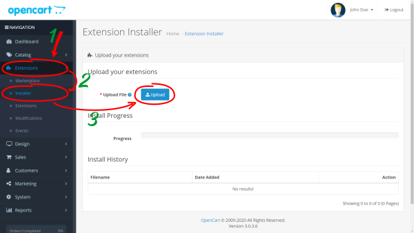

In dialog box, locate the file **model_number_generator_multilang_3.x.ocmod.zip**, select it and click **_Open_**, or double-click on the file name to upload. 

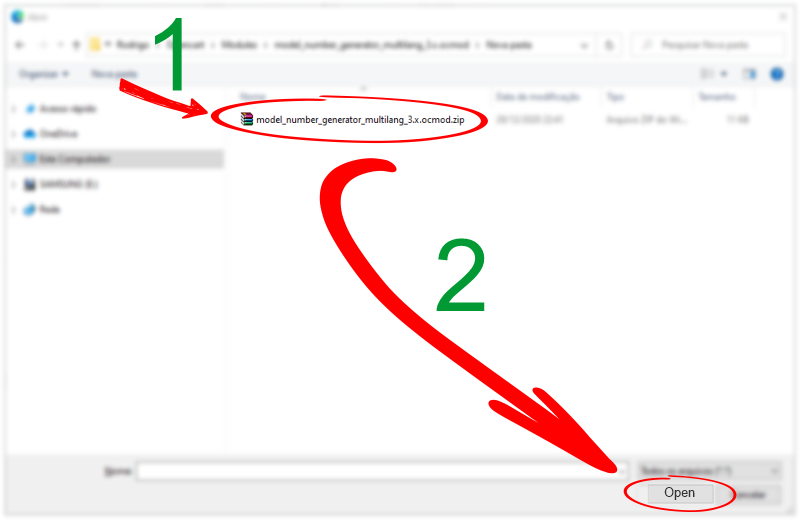

Please wait for the installation to finish, then the module will be listed in the **_Install History_**.

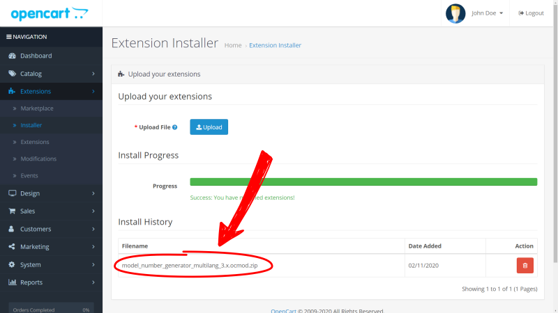

## 4.2. Enable and updating modifications
In **_Dashboard_**:
   1. Go to **_Extensions > Modifications_**.
   2. Check if the module is **_Enabled_**.

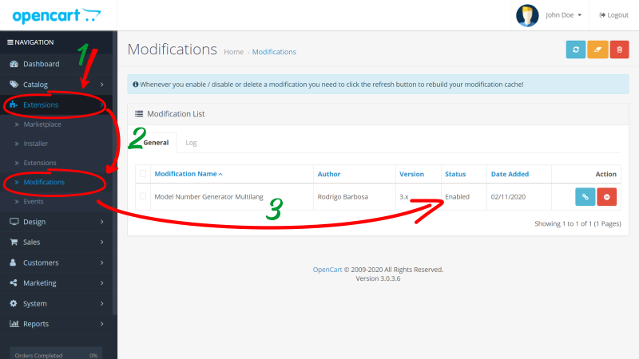

### 4.2.1. Activate module modifications
If the module is **_Disabled_**, click **_Activate_** on the right of the screen.

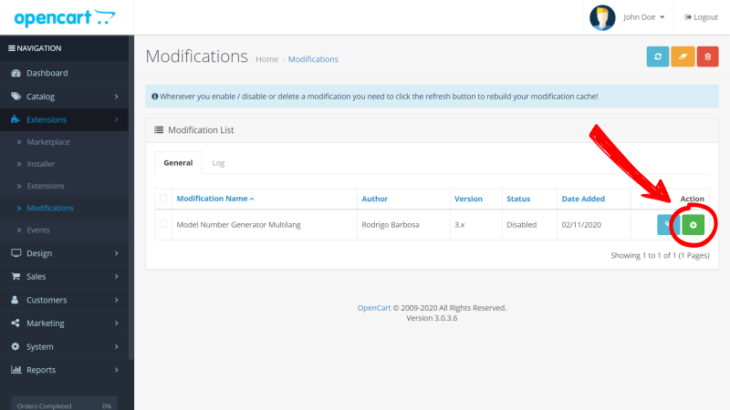

### 4.2.2. Update the modification cache
After [Activate module modifications](#421-activate-module-modifications), it is necessary to update the modification cache by clicking **_Update_**. 

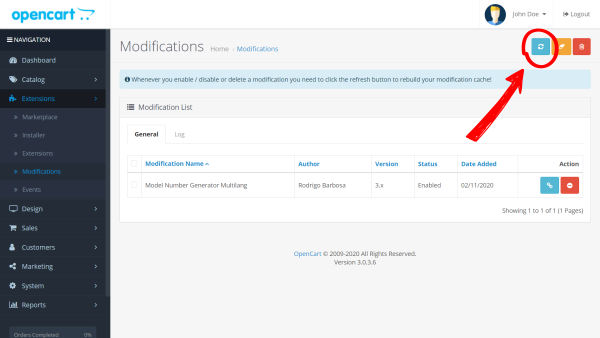

# 5. Permission to access and modify the module settings
In **_Dashboard_**:
  1. Go to **System > Users > Users Groups**;
  2. Locate the group to be edited (i.e. *Administrator*);
  3. Click **Edit** at the end of the line.

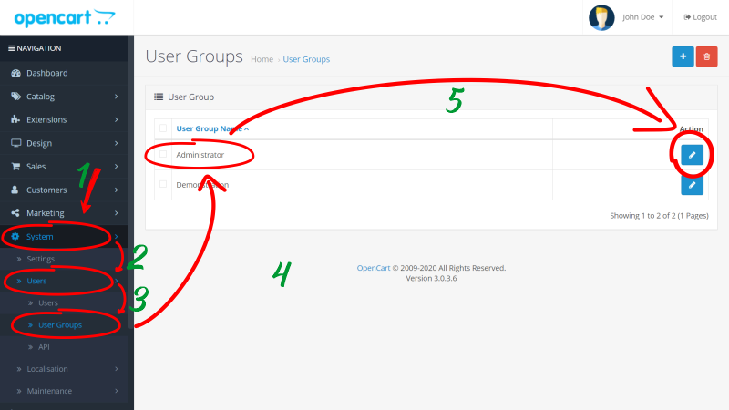

1. In **_Access Permissions_** and **_Modify Permissions_**, locate and select the checkbox on the lines **_extension/module/generate_model_number_multilang_**.
2. Click **_Save_**.

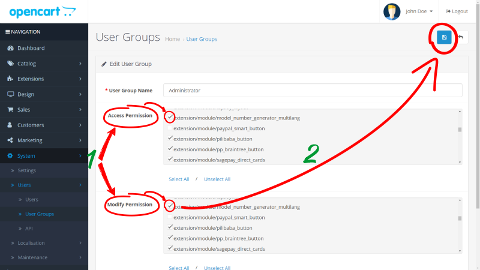

# 6. Enable the module
In **_Dashboard_**.
  1. Go to **_Extensions > Extensions_**.
  2. In **_Choose the extension type_**, select **_Modules_**.
  3. Locate the module line - **_Generate Model Number Multilang_**.
  4. Click **_Install_** at the end of the line.

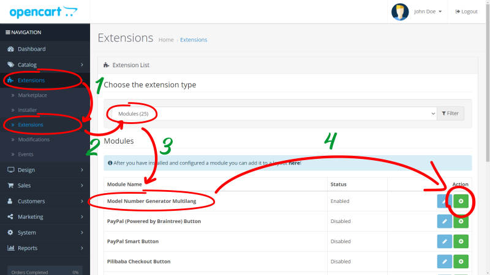

# 7. Configuration

## 7.1. Accessing settings
In **_Dashboard_**:
  1. Go to **_Extensions > Extensions_**.
  2. In **_Choose the extension type_**, select **_Modules_**.
  3. Locate the module line - **_Generate Model Number Multilang_**.
  4. Click **_Edit_** at the end of the line.

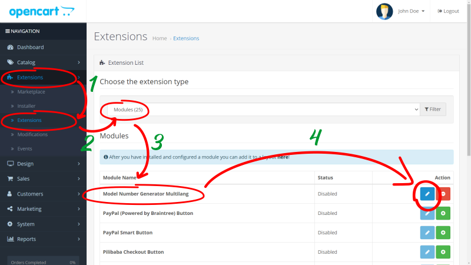

## 7.2. Setting configurations
After [Accessing settings](#71-accessing-settings), the module configuration screen will open.

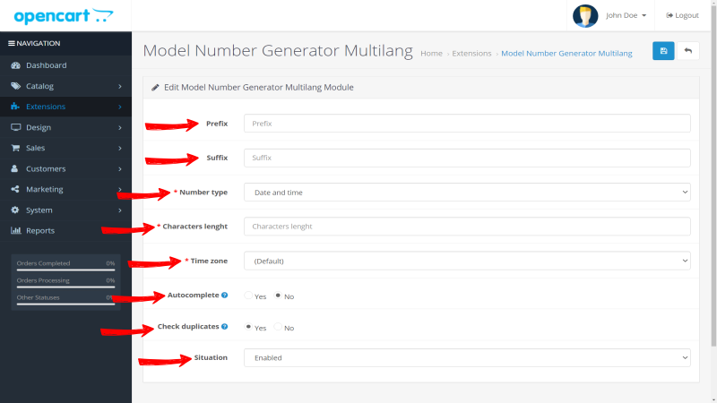

### 7.2.1. Prefix
   Adds a prefix to ***all*** numbers generated by the module.

### 7.2.2. Suffix
   Adds a suffix to ***all*** numbers generated by the module.

### 7.2.3. Numbers types
   Sets the type of numbering to be used.

#### 7.2.3.1. Sequential
   Generates a sequential number with a minimum character length defined in [Characters length](#724-character-length)
#### 7.2.3.2. Random
   Generates an alphanumeric random number using only letters and numbers (a-z and 0-9) with character length defined in [Characters length](#724-character-length)

#### 7.2.3.3. Date and time
Generates a number using the date and time based on time zone defined in UTC+0, in the format YYYYMMDDhhmmss, where:
   * AAAA = Year with 4 digits;
   * MM = Month with 2 digits;
   * DD = Day with 2 digits;
   * hh = Hour with 2 digits in the 24h system - (from 00 to 23);
   * mm = Minutes with 2 digits - (from 00 to 59);
   * ss = Seconds with 2 digits - (from 00 to 59);

### 7.2.4. Character length
Determines the minimum length of characters that will be used to generate the numbers. This field is used only for the **_Sequential_** and **_Random_** types.

> When the numbering type is [sequential](#7231-sequential):
> If the number to be generated has fewer characters than the defined minimum, it will be filled with leading zeros until it reaches the determined length. If the last number generated has reached the maximum value for the number of characters defined, the next numbers will be added by one digit.

|Character length|Max current number|Next number|
|:--:|:--:|:--:|
|3|099|100|
|3|999|1000|

 

> When the numbering type is [Random](#7232-random), the length of characters will always be fixed.

### 7.2.5. Time zone
Select the time zone to create [Date and Time](#7233-date-and-time) models numbers.

### 7.2.6. Autocomplete
Automatically generates a number when starting a new product registration.

### 7.2.7. Block duplicates
Prevents the registration of duplicate model numbers.

### 7.2.8. Status
Enable or disable module.

# 8. Use

In **_Dashboard_**:
  1. Go to **_Catálogo > Produtos_**.

In the products form, click **Generate model number**, a new model number will be generated.

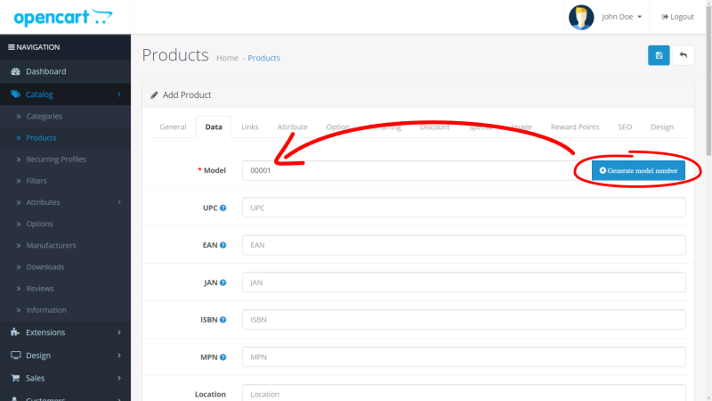

# 9. Uninstall
To completely uninstall follow the 2 steps.
  * [Step 1 - Delete the module](#91-step-1---delete-the-module)
  * [Step 2 - Update modifications](#92-step-2---update-modifications)

## 9.1. Step 1 - Delete the module

In **_Dashboard_**:
1. Go to **_Extensions > Installer_**;
2. Locate the module line - **_Generate Model Number Multilang_**.
3. Click **_Uninstall_** at the end of the line.

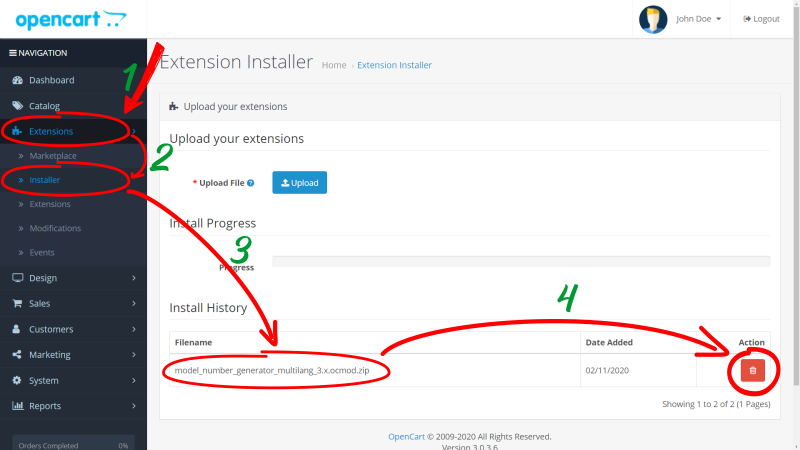

## 9.2. Step 2 - Update modifications

In **_Dashboard_**:
   1. Go to **_Extensions > Modifications_**.
   2. Click **_Refresh_**.

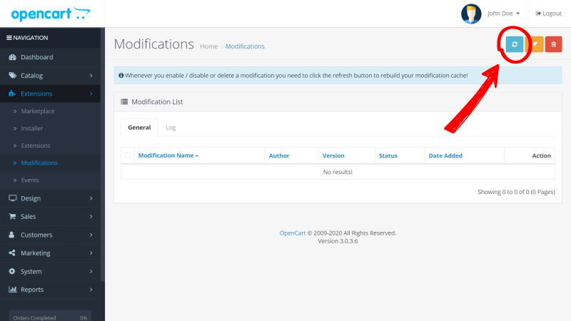

# 10. Licence

GNU General Public License version 3 (GPLv3) - https://www.gnu.org/

# 11. Contact and Support
Rodrigo Barbosa - ab.rodrigo@outlook.com
